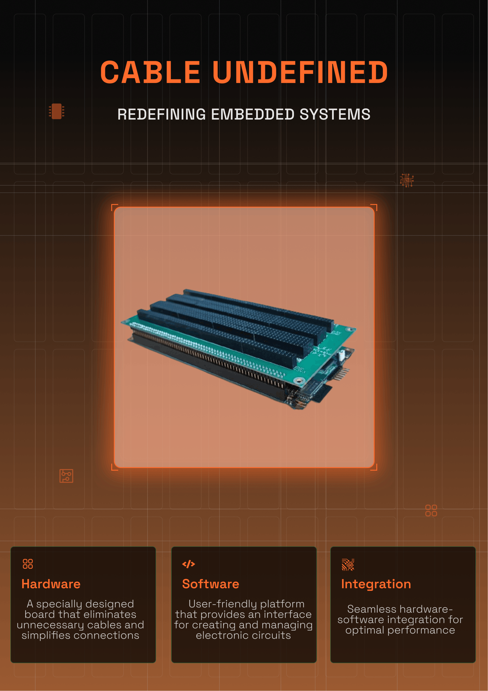
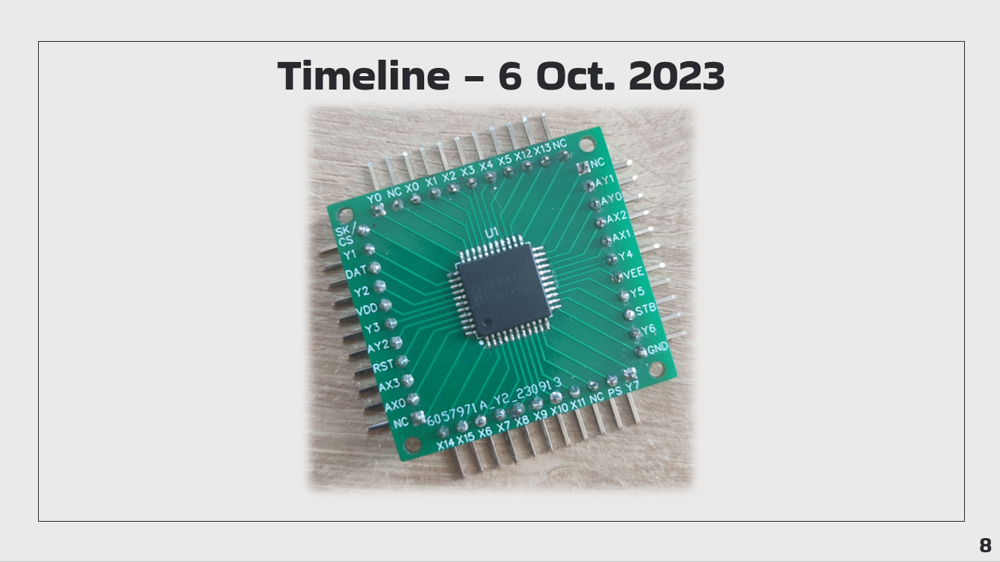
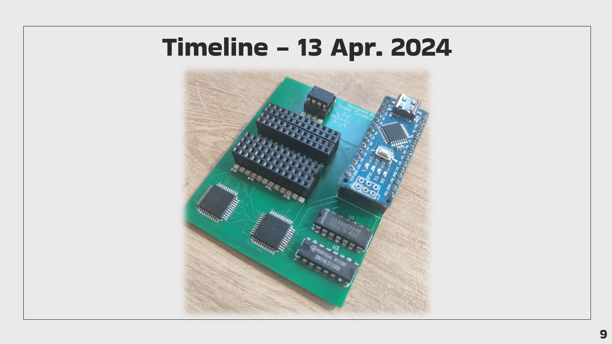
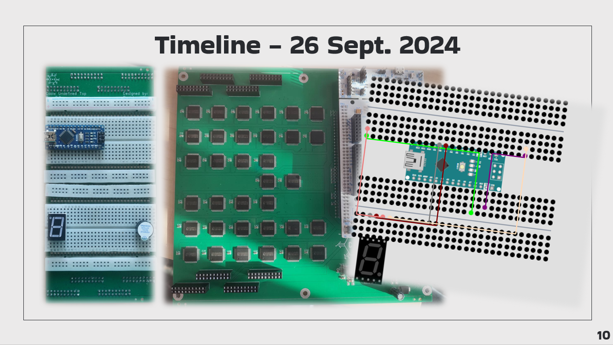
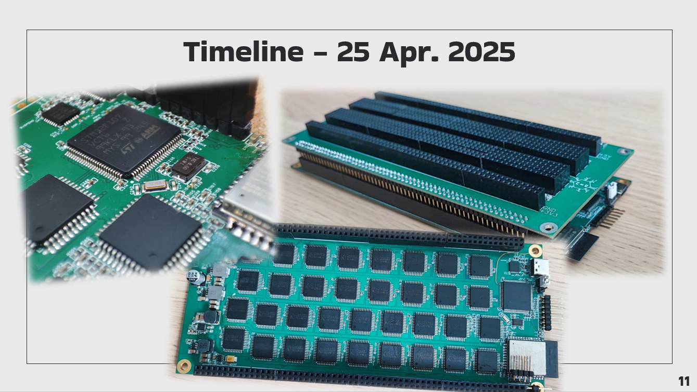

# Cable Undefined



> **An AI-powered intelligent breadboard that eliminates physical jumper wires through a dynamically configurable multiplexer matrix.**

Cable Undefined is an embedded hardware and software platform designed to modernize electronics education and rapid prototyping. Instead of manually wiring components on a traditional breadboard, users create circuits digitally while the hardware automatically establishes the required electrical connections.

The project combines custom hardware, a modern web platform, real-time collaboration, and an AI assistant into a single ecosystem focused on making embedded development faster, safer, and significantly more intuitive.

---

# Motivation

Traditional breadboards are one of the biggest obstacles for beginners in electronics.

Even a single misplaced jumper wire may prevent an entire circuit from functioning, making debugging difficult and frustrating. As circuits become larger, cable management quickly becomes the primary challenge instead of the electronics themselves.

Cable Undefined was created to solve exactly this problem.

Instead of physically connecting components with jumper wires, users simply place components inside a virtual breadboard interface while the hardware automatically routes all electrical connections through an intelligent switching matrix.

The result is a significantly cleaner, faster and more beginner-friendly workflow.

---

# Features

## Intelligent Breadboard

- Dynamically configurable connection matrix
- No jumper wires required
- Up to 120 breadboard pins
- Automatic signal routing
- Real-time visualization of active connections

## AI Copilot

Cable Copilot assists users while building circuits by:

- Suggesting component connections
- Detecting wiring mistakes
- Explaining electronic concepts
- Assisting beginners during prototyping

The AI runs locally using **Ollama + Llama3**, meaning no cloud services are required.

---

## Embedded Hardware

The hardware is based around:

- STM32F107VCT6
- 34 × CH446Q analog multiplexers
- ESP32
- CP2102
- WS2812 RGB LEDs
- ADC-based signal analyzer
- Current protection circuitry

The intelligent multiplexer architecture allows dynamic routing of electronic signals while providing visual feedback through individually addressable LEDs. 

---

## Interactive Web Platform

The platform includes:

- Project management
- Interactive breadboard editor
- Component library
- Community gallery
- User profiles
- Real-time collaboration
- Live hardware synchronization

---


# Architecture

```
                Web Interface
                     │
             Next.js Frontend
                     │
              Spring Boot API
                     │
               WebSocket Layer
                     │
             STM32 Controller
                     │
            Multiplexer Matrix
                     │
             Physical Breadboard
```

---

# Technologies

## Hardware

- STM32F107VCT6
- CH446Q Multiplexers
- ESP32
- CP2102
- WS2812 LEDs
- AP22653 Protection IC
- Custom PCB

## Software

- Next.js
- Spring Boot
- Java
- WebSocket
- Keycloak
- Ollama
- Llama
- MongoDB
- PostgreSQL
- R2DBC

---

# Hardware Highlights

- 120 programmable breadboard pins
- Highly optimised mux routing algorithm
- Integrated mini oscilloscope
- DMA-driven LED controller
- Automatic fault protection
- High-speed UART communication
- Local AI integration

---

# Awards

- TUES Fest 2024, Embedded Category
- RoboDays 2024
- ParaIncubator 2024 2x Sponsorship

---

# Timeline






---

# Project Status

> ⚠️ **Project Discontinued**

Development of **Cable Undefined** has been discontinued.

The decision to stop the project was not driven by technical limitations or lack of progress. Instead, development was halted due to external circumstances involving false accusations, persistent defamation, and intellectual property disputes initiated by a former collaborator. These issues created an environment that made continued development and public presentation of the project impractical.

Despite its discontinuation, Cable Undefined remains an important proof of concept demonstrating how hardware, embedded systems, modern web technologies, and local AI can be combined to significantly improve electronics education and rapid prototyping.

The authors:

Yasen Tsvetkov
Borislav Milanov
Valeri Todorov
Tomislav Ivanov
Emil Momchev
Simeon Simeonov
Valentin Asenov


remain proud of the technical achievements accomplished throughout the project's development.
